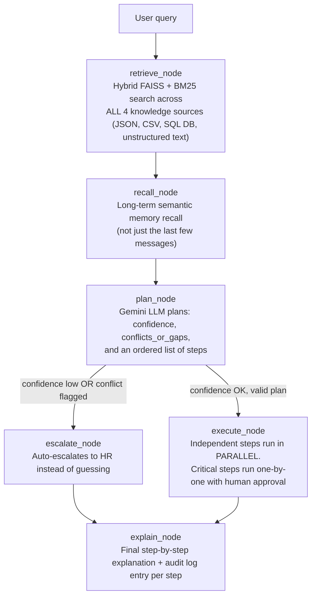

# Autonomous Knowledge Execution Agent — Internal Helpdesk Agent

An agent that perceives (retrieves from **4 internal knowledge sources**),
reasons and **plans multi-step actions**, requires human approval for
critical/irreversible actions, **executes independent steps in parallel**,
gracefully handles **incomplete or conflicting information**, maintains
**long-term semantic memory**, and explains every decision — all built with
free, open-source tools and a free-tier LLM API.

## Architecture



**Flow in words:** a query is first matched against all 4 knowledge sources
and relevant long-term memory. The LLM then plans one or more steps. If it
isn't confident, or the sources disagree, the agent escalates to a human
instead of guessing. Otherwise it executes the plan — independent steps run
in parallel, critical/irreversible ones always wait for human approval —
and finally explains exactly what it did and why.

## Why no step is "hardcoded"

The knowledge sources are just data. The planner (`agent/planner.py`) is
the only place that decides *what to do*, and it's a live Gemini call: it
reads the retrieved knowledge + long-term memory and returns the plan as
JSON. Python only retrieves data, executes whatever the LLM decided,
enforces the human-approval gate for critical actions, and logs everything.

## The 4 knowledge sources (multiple sources, simultaneously)

| Source | File | Type |
|---|---|---|
| Policy knowledge base | `data/knowledge_base.json` | Structured JSON |
| Ticket history | `data/tickets_history.csv` | Structured CSV |
| Employee records | `employees.db` (auto-created SQLite) | Structured Database |
| Company handbook | `data/handbook_unstructured.txt` | **Unstructured text**, chunked with overlap (`knowledge/chunker.py`) before embedding |

All 4 are normalized into one shape (`knowledge/sources.py`) and merged
into a single hybrid FAISS + BM25 index (`knowledge/retriever.py`), so a
query searches all of them together, with each hit labeled by source.

## Handling incomplete / conflicting information

`data/knowledge_base.json` says employees get **18** leave days.
`data/handbook_unstructured.txt` (deliberately) says **around 20**.
When a query touches this, the planner sees both, sets `confidence: "low"`,
fills in `conflicts_or_gaps` with a plain-English explanation, and the
graph routes to `escalate_node` — the agent escalates to HR **instead of
guessing or picking one source arbitrarily**.

## Multi-step planning + parallel execution

A query like *"check my leave balance and also show me similar past
laptop tickets"* produces two independent steps with no `depends_on` —
`agent/executor.py` runs them in a **parallel** thread batch. A query like
*"check my balance, then request 2 days off"* produces a step that
`depends_on` the first, so it runs strictly after it. Every step (parallel
or not) is logged individually to the audit trail under one shared
`plan_id`.

## Human approval for critical actions

`reset_password` and `deactivate_account` are marked critical
(`actions/actions.py` -> `CRITICAL_ACTIONS`). They're pulled out of any
parallel batch and run one at a time, each blocking on an explicit
CLI approval before execution.

## Long-term memory

`memory/audit_log.py` logs every step of every plan to SQLite
(`agent_memory.db`) with a shared `plan_id`. `memory/long_term.py` embeds
every past interaction and searches them **semantically** — so a
relevant exchange from many turns ago can resurface, not just the last
few messages (which is all typical "short-term" memory gives you).

## Free resources used (no paid API/service anywhere)

| Component | Tool | Why free |
|---|---|---|
| LLM reasoning/planning | **Google Gemini API** (`gemini-3.1-flash-lite`) | Free tier, no credit card — https://aistudio.google.com/app/apikey |
| Embeddings | **sentence-transformers** (`all-MiniLM-L6-v2`) | Open-source, runs locally, downloads once, zero cost |
| Vector search | **FAISS** | Open-source, local |
| Keyword search | **rank_bm25** | Pure Python, open-source |
| Orchestration | **LangGraph** | Open-source |
| Structured DB | **SQLite** (Python built-in) | No server, no install |

## Project structure

```
agentic-helpdesk/
    data/
        knowledge_base.json          JSON knowledge source
        tickets_history.csv          CSV knowledge source
        employees_seed.json          seeds the SQL database
        handbook_unstructured.txt    unstructured knowledge source

    knowledge/
        sources.py      loads and normalizes all 4 sources
        chunker.py       splits unstructured text into chunks
        db_setup.py       creates/queries the SQLite employee DB
        retriever.py       hybrid FAISS + BM25 search across all sources

    agent/
        llm_client.py    shared Gemini client
        planner.py         multi-step planning + confidence/conflict detection
        executor.py          parallel batching + critical-action approval gate
        graph.py               LangGraph: retrieve -> recall -> plan -> escalate/execute -> explain

    actions/
        actions.py       the real actions the agent can execute

    memory/
        audit_log.py     SQLite audit trail (per plan, per step)
        long_term.py       semantic long-term memory recall

    main.py              CLI entry point
    requirements.txt
    .env.example
    README.md
```

## Setup

```bash
python3 -m venv venv
source venv/bin/activate        # Windows: venv\Scripts\activate
pip install -r requirements.txt
cp .env.example .env            # then paste your free Gemini key into it
python3 main.py
```

Get a free Gemini key (no credit card): https://aistudio.google.com/app/apikey

First run downloads the small local embedding model (~80MB) and creates
`employees.db` + `agent_memory.db` automatically.

## Example queries to try

- `"my laptop is very slow"` — single step, pulls similar past tickets from CSV
- `"check my leave balance, my employee ID is EMP003"` — reads real data from the SQL database
- `"check my leave balance and also show me similar laptop tickets"` — two independent steps, run in **parallel**
- `"check my leave balance, then request 2 days off"` — dependent steps, run in **sequence**
- `"how many total leave days do employees get"` — triggers a **conflict** (JSON says 18, handbook says ~20) → agent escalates to HR instead of guessing
- `"reset my password, I'm locked out"` — **critical action**, requires typed (y/n) approval

## Bonus requirements — where each one lives

| Requirement | Implementation |
|---|---|
| Unstructured data | `data/handbook_unstructured.txt` + `knowledge/chunker.py` |
| Multiple knowledge sources (JSON/CSV/DB/Vector) | `knowledge/sources.py`, merged in `knowledge/retriever.py` |
| Long-term memory | `memory/long_term.py` (semantic recall over full audit history) |
| Parallel execution | `agent/executor.py` (`ThreadPoolExecutor` on independent steps) |
| Multi-step reasoning/planning | `agent/planner.py` (`steps` list with `depends_on`) |
| Human approval for critical actions | `agent/executor.py` + `actions/actions.py` (`CRITICAL_ACTIONS`) |
| Audit logs | `memory/audit_log.py` (`plan_id` + per-step rows) |
| Handle incomplete/conflicting info | `agent/planner.py` (`confidence`, `conflicts_or_gaps`) + `escalate_node` in `agent/graph.py` |
| Reasoning before execution | Every step in the plan carries its own `reasoning`, shown before its result |

## Notes / limitations

- Actions are simulated (structured results, no real ticketing/HRMS
  backend) — the assignment evaluates autonomous reasoning and
  action-selection, not a production integration.
- If Google renames/retires `gemini-3.1-flash-lite`, check
  https://ai.google.dev/gemini-api/docs/models and update `GEMINI_MODEL`
  in `.env`.